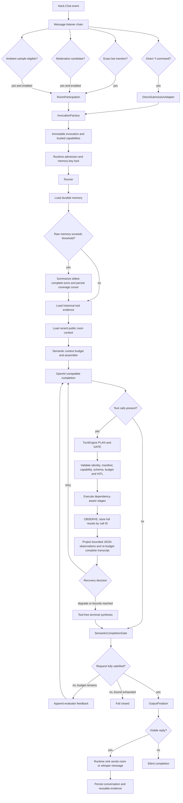

# Zenbot Agentic Architecture

## Purpose

Zenbot's agent layer adapts Saturn's Vaelen behavior to Go without giving the model direct access to transport, persistence, or moderation internals. The model proposes text and typed tool calls. Zenbot owns identity, capabilities, schemas, ordering, deadlines, command authorization, room delivery, and durable memory.

The production composition root is `cmd/zenbot/main.go`. Agent implementation lives under `internal/agent`, command execution remains under `internal/command`, and H2-backed context and memory remain under `internal/repository/h2`.

## Active Request Path



## Components

### Ingress And Invocation

- `internal/agent/live/direct_submission.go` adapts `*l` into the shared runtime.
- `internal/agent/live/participation.go` adapts exact mentions, optional ambient samples, and semantic moderation candidates.
- `internal/agent/participation/invocation.go` derives capabilities only from the trusted room snapshot. User prompt text cannot grant a capability.
- `cmd/zenbot/main.go` builds the snapshot from the current master, configured admins, and persisted moderator/admin roles.

Invocation modes are:

| Mode | Source | Reply requirement | Capability notes |
|---|---|---:|---|
| `DIRECT` | `*l <prompt>` | Required | Creator may receive admin and permanent-ban tools |
| `MENTION` | Exact public `@bot` mention | Required | Trusted admins/moderators may receive moderation tools |
| `AMBIENT` | Configured public sample | Optional | Privileged action capabilities are withheld |
| `MODERATION` | Semantic candidate | Silent | Only target-bound moderation actions are eligible |

### Runtime And State Isolation

`internal/agent/runtime/runtime.go` provides bounded admission, whole-request deadlines, cancellation, and per-memory-key ordering. Its reference-counted keyed locks are reclaimed after each request. Each invocation creates a fresh turn state, semantic task contract, tool execution ledger, and full-result observation store. Tool counts, failures, duplicate keys and call IDs, successful prerequisites, observations, and provider transcripts never cross request boundaries.

Public turns use `<room>|public` as the memory namespace, so users in one room can continue a shared conversation. Whispers use trip, then hash, then nick identity in a private namespace. Different rooms never share memory.

The runtime invokes `AfterDelivery` only after a visible response is successfully sent. A successful `ROOM_DELIVERY` tool owns delivery, suppresses the duplicate model reply, and still produces one memory artifact after tool success. This prevents undelivered provider text from becoming history without making command-backed turns disappear from memory.

### Prompt Assembly

`internal/agent/assemble/assemble.go` and `internal/agent/assemble/context.go` combine:

- the extracted prompt resources under `resources/agent`
- immutable invocation metadata and current user prompt
- bounded durable conversation memory
- recent public room context from H2
- reusable historical tool evidence
- the capability-filtered provider tool manifest

The same context projector runs before the initial worker request, every tool follow-up, task-obligation or semantic correction, terminal synthesis, and final reflection. It operates on complete semantic units and never slices serialized JSON. It supports a configured ceiling up to 1,000,000 estimated tokens, accounts for the live tool manifest, reserves output/policy capacity, deduplicates repeated source fingerprints, and retains newer high-priority units first. Assistant tool calls and all matching tool observations are one atomic unit. Trusted policy, the immutable task contract, and the exact newest request are mandatory; assembly fails before provider I/O if they cannot fit. `MaxPromptChars` is independently enforced by Unicode code point at intake.

Durable summaries, memory, historical evidence, and room rows are separate untrusted user-role context; none are interpolated into the system role. The immutable request hash, original objective, constraints, pending obligations, verified evidence, and unknown-action state are regenerated from trusted request-local state on each worker-model cycle rather than copied from model output.

Named-user profile/history requests require fresh `user_message_history` evidence. That tool reads up to 500 latest `PUBLIC` rows across rooms by default, or one specified room, with timestamps, nick, trip, hash, channel, and text.

### Provider

`internal/agent/llm/openai/client.go` calls `<agent.endpoint>/v1/chat/completions`. It sends the optional model, completion-token bound, contextual tools, and `chat_template_kwargs.enable_thinking`. The configured operation timeout covers retries and retry backoff. Only transient transport/status failures are retried.

Provider accounting is schema-open optional metadata. Integer usage counters are
retained through the stable `Usage()` API, while nested details and unfamiliar
value shapes are ignored. Provider additions therefore cannot invalidate an
otherwise usable completion.

Tool manifests remain present on every correction round. This is required for the model to repair invalid arguments or choose a fallback tool after receiving an error observation.

## Tool Contracts

All tools implement `internal/agent/tool.Tool`:

```go
type Tool interface {
    Name() string
    Descriptor(api.Context) (contract.Descriptor, error)
    Execute(context.Context, api.Context, json.RawMessage) (contract.Result, error)
}
```

A descriptor defines the stable name, unique primary intent, label, capability description, negative guidance, strict JSON parameter schema, result schema, maximum model-visible result bytes, access, effect, result mode, idempotency, timeout, prerequisites, resource reads/writes, and optional semantic `RoutingMetadata`. Routing metadata contains aliases, targets, positive selection guidance, and schema-valid request/argument examples. Construction recursively validates every registered descriptor, including typed `const` values and exactly-one `oneOf` branches, and rejects unsupported schema keywords or malformed examples before the live loop is accepted.

`Registry.Manifest` is the checked boundary between registration and provider assembly. It returns a deterministic, versioned, caller-capability-filtered manifest, rejects duplicate caller-visible primary intents, hides executor-only fallbacks, and propagates descriptor errors instead of silently dropping a tool. The complete JSON manifest retains every local contract field. `ManifestEntry.ProviderDefinition` projects only the routing-critical intent/label summary and parameter schema into the OpenAI-compatible function shape. Provider declarations set `strict: true`; local recursive schema validation and encoder parity tests remain authoritative. The full creator-visible provider tool payload is kept at or below 32 KiB.

Complete typed results stay in the request-local `ObservationStore`, keyed by the provider call ID. The provider transcript receives a bounded view:

```json
{
  "callId": "call_123",
  "tool": "database_query",
  "status": "success",
  "summary": "{\"head\":[...],\"tail\":[...]}",
  "returnedCount": 200,
  "truncated": true,
  "continuationId": "opaque-request-local-id"
}
```

Arrays and row objects retain original counts plus deterministic bounded head/tail samples; ordinary objects retain lexical fields that fit; strings are truncated by rune. The complete envelope is marshalled after selection, never byte-sliced. A malformed success becomes an `INVALID_TOOL_RESULT` error view. Stable tool errors remain concise semantic instructions; repository errors and stack traces are not copied into observations.

Expected command validation or authorization failures become coded observations. Read-only work may return promptly on cancellation. Action work runs synchronously: the executor does not return while its in-process action is still running. If cancellation occurs without a verified typed terminal result, the outcome is `ACTION_OUTCOME_UNKNOWN`; recovery disables tools and proceeds to one uncertainty-aware terminal synthesis without any exact or modified action retry.

### Production Tool Inventory

| Tool family | Effect | Parallel eligibility | Access |
|---|---|---:|---|
| `user_message_history` | Read-only model data | Yes | Public invocation |
| `room_users` | Current-room presence | Yes | Public invocation |
| `database_query` | Fixed read-only query | Yes | Public invocation |
| `database_schema` | Read-only schema | Yes | `DYNAMIC_SQL` |
| `database_sql` | Bounded read-only SQL after schema | Sequential prerequisite chain | `DYNAMIC_SQL` |
| `saturn_<command>` | One concrete Saturn command | Never | Command-specific capability |

`room_users` accepts no room selector and is authoritative only for the caller's current room. Presence in another room routes exclusively through `saturn_list`, which rejects the current room before gateway execution.

The complete command mapping is in [COMMAND_TOOL_INVENTORY.md](COMMAND_TOOL_INVENTORY.md).

## Tool Loop And State Machine

The active generalized loop is coordinated by `internal/agent/live/turn_engine.go`. `internal/agent/live/tool_loop.go` owns initial assembly, while `internal/agent/live/registry_loop.go` adapts protocol messages and delegates generalized execution. No keyword or regular-expression intent router chooses tools. The provider uses the standard OpenAI tool protocol: it may return candidate content or one or more structured calls from the caller-filtered manifest. `SemanticCompletionGate` independently evaluates every zero-tool candidate against the newest request, recent conversational context, caller-visible tool capabilities, and current-turn observations. The closed phases are `ASSEMBLE -> MODEL -> PLAN -> GATE -> EXECUTE -> OBSERVE`, followed by another model cycle or `REFLECT -> FINALIZE -> COMPLETE`. `PAUSED` and `FAILED` remain explicit bounded branches.

1. The registry computes a checked manifest for the current trusted context, hides unauthorized and internal-fallback tools, rejects primary-intent collisions, and orders entries by stable tool name.
2. The manifest is compactly projected and the assembler sends one provider request with all eligible definitions using `tool_choice: auto`.
3. A response with no calls is only a candidate final answer. A separate constrained evaluator must return a structured `FINAL` decision before delivery. `CONTINUE` feedback is appended to the transcript and the same authorized manifest remains available to the worker model. This evaluator is semantic and runs for every candidate; it does not use keyword intent heuristics.
4. Every returned call must have a nonblank ID and registered name. IDs must be unique both within a batch and across the entire turn, so correction cannot overwrite an earlier observation mapping.
5. The executor validates capability prerequisites and the strict argument schema before invoking code.
6. The request-local ledger rejects duplicate call-and-argument keys, per-tool overuse, missing successful prerequisites, and tools disabled after repeated failures.
7. Consecutive independent calls may execute concurrently only when every descriptor is read-only, idempotent, prerequisite-free, and resource-compatible.
8. Any action, command, dependency, or resource conflict creates an ordering barrier and executes sequentially in provider order.
9. Results are restored to source order, retained in the full request-local store, projected under the descriptor's byte ceiling, and appended as one assistant `tool_calls` message followed by matching bounded JSON observations.
10. `RecoveryPolicy` keeps the authorized manifest only for correctable failures such as invalid arguments, unknown tools, execution failures, and read timeouts. Disabled tools and unknown action outcomes switch immediately to tool-free degradation; `ACTION_OUTCOME_UNKNOWN` is never retried.
11. Reaching the tool-round bound reserves one independent tool-free terminal synthesis call, so the newest observations are never discarded. Its candidate must still pass semantic completion; an unsatisfied candidate at the bound fails closed.
12. The semantic evaluator itself receives only a compact conversation projection, compact caller-visible capability descriptions, and bounded observation content. It must call `submit_completion_assessment` with `FINAL` or `CONTINUE`; it cannot execute Saturn tools.
13. Empty, truncated, tool-calling, or repeated final content receives at most one tool-free structural repair call before failing closed. A second truncated initial response fails immediately after its compact retry.
14. Stateful calls pass through `InterruptHook`. The default allows existing behavior; deny becomes an `ACTION_DENIED` observation and pause returns a typed checkpoint before side effects. `TurnEngine.ResumeAction` verifies the resume token and re-runs current registry, schema, and capability checks. Approved actions execute synchronously.

The relevant bounds are:

| Setting | Enforced by | Meaning |
|---|---|---|
| `maxCompletionTokens` | provider client | Maximum tokens generated by one provider call; keep it close to the useful reply size |
| `maxOutputChars` | output finalizer | Maximum characters delivered to chat after generation |
| `maxSteps` | turn state | Maximum worker-model iterations; each candidate may add one constrained semantic evaluation |
| `maxToolCallsPerTurn` | turn state | Aggregate calls reserved by one request |
| `maxCallsPerTool` | execution ledger | Distinct calls to one tool |
| `maxToolFailures` | execution ledger | Failures before that tool is disabled for the request |
| `toolTimeoutMillis` | executor | Default when a descriptor has no timeout |
| descriptor timeout | executor | Per-tool override |
| descriptor model-result bytes | observation projector | Maximum complete JSON observation view for one result |

## Command Execution

Command identity and aliases have one source in `internal/command/catalog/catalog.go`. The same `catalog.Entry` also owns `AgentToolSpec`: actionability or a hidden reason, label, description, category, access, targets, use/avoid guidance, examples, argument strategy, moderation targeting, and compatibility flags. `internal/command/registry.go` materializes chat handlers from that catalog, while production composition creates one `saturn_<canonical>` adapter for each of the 59 actionable entries. The five non-actionable entries are `l`, `mine`, `whiskey`, `ws`, and `wsa`.

`AgentArgumentContract` exposes an immutable JSON schema and an encoder. Empty, positional, boolean-state, comma-list, kick, shadow-ban, auto-move, and notes strategies translate strict structured fields into the existing command tail. The adapter validates the descriptor schema and strategy cross-field rules before invoking the gateway; no model-authored raw command string crosses this boundary.

`internal/command/agent_gateway.go` reconstructs a normal Saturn command message using the current prefix and trusted caller identity. It resolves the current master for every invocation, applies command/capability authorization, binds autonomous moderation to its reviewed author, captures command output, and records the command audit result. Agent success requires a typed `commandgateway.Execution`: legacy status alone is insufficient. Stateful commands must report committed effects, room-delivery tools must report a positive delivery receipt, and not-found queries remain typed failures rather than successful empty prose.

The model cannot directly send websocket payloads, write the database, change its role, or select an arbitrary command outside the contextual manifest.

## Memory And Evidence

`internal/agent/turn/memory.go` and `internal/agent/live/memory.go` adapt H2 repositories into bounded memory. Conversation rows are loaded by memory key, TTL, and turn count. Public and whisper contexts remain separate.

When loaded history exceeds `memoryRawTurns`, `ModelConversationSummarizer` sends complete oldest user/assistant pairs to a tool-free summarization request. Raw text remains in an untrusted user-role payload. H2 stores the resulting summary, source fingerprint, and covered row ID in `agent_memory_summary`; subsequent loads exclude covered rows and prepend the summary to the raw tail. Raw `agent_memory` rows remain authoritative until TTL cleanup.

Conversation, assistant outcome, and reusable tool evidence are committed through one `AppendAgentTurn` transaction. A failed evidence insert rolls back the whole turn, preventing half-written conversational state.

Reusable tool evidence is persisted only for successful eligible model-data tools. Command room-delivery results, unknown action outcomes, and unverified deliveries are never persisted as completed work or replayed as fresh facts. The LLM-facing contract requires live `user_message_history`, current-room `room_users`, or remote-room `saturn_list` evidence instead of treating old prose as current evidence; selection remains LLM-backed rather than keyword-routed.

Recent room context and user-history queries read only `PUBLIC` messages. New whispers are stored as `WHISPER`; schema upgrades classify legacy null visibility as `PUBLIC` for Saturn compatibility.

## Output And Failures

`internal/agent/live/runner.go` sends provider content through `OutputFinalizer` before delivery. It:

- normalizes response formatting
- preserves ordinary provider answers instead of coercing them into a quotation or fixed template
- rejects empty required replies
- strips the no-reply marker from otherwise valid text
- rejects leaked internal tool evidence
- applies the configured Unicode output bound
- supports intentional silence for non-required ambient/moderation turns

Reply-required runtime failures use the configured failure sink. Tool failures do not crash the runtime; they become coded observations unless the enclosing context was cancelled.

## Operational Observability

Every production invocation carries its request ID through structured `slog`
events. The same `request_id`, `mode`, `room`, and `nick` fields connect runtime,
context, provider, tool-loop, delivery, and persistence activity. Logs record
counts, stage names, finish reasons, error codes, HTTP status, and durations;
they do not record prompts, API keys, tool arguments/results, database rows, or
conversation contents.

The primary lifecycle events are:

- `agent.request.started`, `agent.request.completed`, and `agent.request.failed`
- `agent.context.loaded` and `agent.context.load_failed`
- `agent.request.assembled`, `agent.loop.started`, `agent.loop.cycle`,
  `agent.loop.completed`, and `agent.loop.failed`
- `agent.completion_gate.started` and `agent.completion_gate.completed`, including the structured decision and observation count without logging prompt contents
- `agent.llm.request.started`, `agent.llm.attempt.retrying`,
  `agent.llm.request.completed`, and `agent.llm.request.failed`. Invalid JSON
  also emits `agent.llm.response.malformed` with the parser offset, response
  size, media type, and SHA-256 fingerprint, never the response body.
- `agent.tool.batch_started`, `agent.tool.started`, `agent.tool.completed`, and
  `agent.tool.batch_completed`
- `agent.correction.started`, with `stage` distinguishing semantic-completion,
  command, tool-follow-up, and synthesis calls
- `agent.response.finalized`, `agent.response.finalization_failed`,
  `agent.delivery.completed`, and persistence failure events

For Docker deployments, follow all events with `docker logs -f zenbot`. Filter
for one turn by its `request_id`, or filter `agent.` to inspect only agentic
activity. A generic room failure now always has a matching
`agent.request.failed` event containing the wrapped server-side cause.

## Configuration

`internal/config/agent_config.go` accepts both native Zenbot names and Saturn TOML/environment names. Environment values take precedence over TOML. See [config.example.toml](config.example.toml) and [.env.example](.env.example) for the complete surface.

The creator trip must be supplied explicitly when the agent is enabled. It is
retained in the ignored production configuration and is not compiled into the
binary or published in the tracked examples.

The local real `config.toml`, `.env`, and database files are intentionally ignored and excluded from Docker build contexts. `make run` mounts the chosen config rather than baking environment-specific values into the image.

The main hardening controls are `requestTimeoutMillis`, `maxSteps`, `maxToolCallsPerTurn`, `maxCallsPerTool`, `maxToolFailures`, `toolTimeoutMillis`, `maxContextTokens`, `contextReserveTokens`, `memoryTurns`, `memoryRawTurns`, and `memorySummaryMaxChars`. The tracked examples document matching `SATURN_AGENT_*` environment aliases. `memoryRawTurns` must not exceed `memoryTurns`; HITL remains default-allow unless composition supplies another `InterruptHook`.

## Verification Map

- `internal/agent/live/turn_engine_test.go`: semantic completion, closed loop recovery, reflection, terminal synthesis, interruption, and authorization revalidation on resume
- `internal/agent/live/semantic_completion_gate_test.go`: constrained evaluator protocol and malformed-decision rejection
- `internal/agent/live/registry_loop_test.go`: end-to-end semantic correction, multi-tool ordering, parallel read fan-out, per-tool/failure limits, cross-round call-ID uniqueness, and every-request context budgeting
- `internal/agent/assemble/observations_test.go`: request-local full-result retention and deterministic bounded JSON projections
- `internal/agent/tool/execution/execution_test.go`: validation, authorization, cancellation, default/descriptor timeouts, ledger behavior
- `internal/agent/tool/*_test.go`: schemas and individual tool contracts
- `internal/command/catalog/agent_contract_test.go`: exhaustive actionability,
  metadata, schema-example, defensive-copy, and typed encoder coverage
- `internal/agent/runtime/*_test.go`: admission, cancellation, memory-key ordering, ambient coalescing
- `internal/agent/turn/*_test.go`: phases, recovery, evidence, memory compaction, and policy state
- `cmd/zenbot/live_agent_test.go`: production composition, contextual command visibility, moderator/admin role propagation
- `internal/repository/h2/agent_*_test.go`: atomic turns, persisted summaries, context, schema, SQL, and 500-message history
