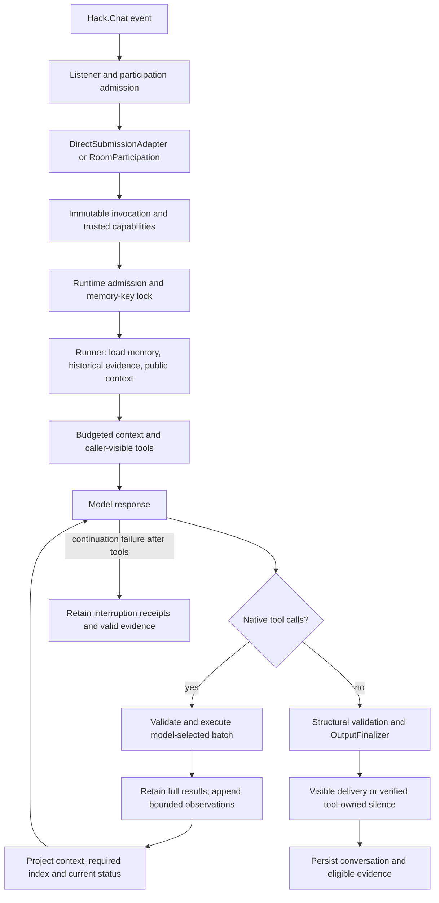

# Zenbot Agentic Architecture

## Responsibility And Request Path

Zenbot's agent layer adapts Saturn's Vaelen behavior to Go without giving the model direct access to transport, persistence, or moderation internals. The model interprets the request, selects and orders tools, evaluates conditions, reacts to observations, and decides when to answer. Zenbot enforces identities, capabilities, schemas, execution safety, resource bounds, delivery receipts, and persistence.

There is one iterative model/tool loop. There is no semantic completion judge, preliminary planner, intent-routing phase machine, or runtime-generated task checklist. A valid final model response completes the loop; the runtime checks its structure and delivery rules, not whether its reasoning satisfied every requested step.

The production composition root is `cmd/zenbot/main.go`. Agent implementation lives under `internal/agent`, command execution under `internal/command`, and H2-backed context and memory under `internal/repository/h2`.



### Ingress And Isolation

- `live/direct_submission.go` adapts `*l` into the same process-owned runtime as mentions, ambient turns, and moderation. The legacy synchronous `DirectInvoker` is not the production command route.
- `live/participation.go` admits exact mentions, optional ambient samples, and moderation candidates.
- `participation/invocation.go` derives capabilities from the trusted room snapshot, never from prompt text. Production supplies the current master, configured admins, and persisted moderator/admin roles.

| Mode | Source | Reply requirement | Capability notes |
|---|---|---|---|
| `DIRECT` | `*l <prompt>` | Required | Creator may receive admin and permanent-ban tools |
| `MENTION` | Exact public `@bot` mention | Required | Trusted admins/moderators may receive moderation tools |
| `AMBIENT` | Configured public sample | Optional | Privileged action capabilities are withheld |
| `MODERATION` | Moderation candidate | Silent | Moderation actions are bound to the reviewed target |

`runtime/runtime.go` provides bounded admission, whole-request deadlines, cancellation, ambient coalescing, and per-memory-key ordering. Reference-counted keyed locks are reclaimed after requests. Public turns share `<room>|public`; whispers use trip, then hash, then nick in a private namespace. Different rooms never share memory.

Each invocation creates a fresh execution ledger, observation store, retrieval tool, and provider transcript. Tool attempts, failure budgets, successful prerequisites, duplicate protection, and unknown-action blocking are request-local. Persisted historical receipts are not live retrieval handles or a cross-request idempotency guarantee.

## Single Model/Tool Loop

`live/tool_loop.go` owns composition and initial assembly. `live/turn_engine.go` runs the iteration; `live/registry_loop.go` appends matching protocol messages. The loop:

1. Builds a checked, caller-filtered manifest and adds request-local `read_tool_result`. Whisper requests expose no tools.
2. Assembles the newest request with policy and bounded context, then requests an OpenAI-compatible completion with eligible tool definitions.
3. Accepts a structurally valid response without tool calls as the model's final answer. No second model evaluates semantic completion.
4. Checks nonblank call IDs/names and IDs unique within the batch and across the turn. Malformed or truncated protocol executes no calls from that response.
5. Reserves the batch's call budget and validates manifest access, trusted capabilities, argument schema, prerequisites, and ledger state before execution. Invalid arguments become useful coded observations.
6. Runs compatible declared-safe reads concurrently. Actions and undeclared resource access are barriers, executed in provider order. Results return in original call order.
7. Stores original arguments and full results by call ID, then appends one assistant `tool_calls` message and its matching bounded tool observations.
8. Gives observations back to the same model with the still-available tools. The model may correct arguments, satisfy prerequisites, retry an eligible read, choose another tool, continue unrelated work, or finish with a limitation.
9. Reprojects context before each follow-up. Current resource status and the compact result index are required context, even when older call/result pairs are pruned.
10. At the round or call bound, makes a tool-free terminal synthesis request with current evidence. A single structural repair allowance covers invalid final content or protocol; it is not a semantic retry budget. Tool calls during terminal synthesis are rejected, never executed.

Independent calls may be batched. Dependent or conditional work belongs in a later model round after its input is known. The executor does not infer dependencies or evaluate natural-language conditions. If an ordered action fails, later actions in that same batch are explicitly `ACTION_NOT_EXECUTED`, linked to the failed call; read-only work can still proceed. The model chooses the next supported step from these observations.

### Execution Ledger And Cancellation

The ledger bounds attempts and invoked failures separately. Argument validation does not spend the execution-failure budget. It retains successful prerequisites, rejects reused IDs and unsafe duplicate executions, and links duplicate/skipped results to the original call through `relatedCallId`. A known failed read or known uncommitted action can be tried again when its contract and budgets allow; committed or uncertain actions must not be replayed as a recovery shortcut.

Effect state is explicit: `NOT_STARTED`, `NOT_COMMITTED`, `COMMITTED`, `PARTIAL`, or `UNKNOWN`. `effectsCommitted`, `actionCount`, and `deliveryCount` preserve positive receipts, including on error. An error is not proof that no effects occurred. Once an action has unknown outcome, further actions are blocked for that invocation while read-only tools remain available to investigate. Reads do not automatically lift that block.

Cancellation is cooperative, not process preemption. Reads can return on deadline while their handler finishes in the background; implementations still need to honor context. Actions execute synchronously so the executor does not return while its in-process action is still running. An action or transport that ignores context can exceed the nominal deadline. Missing verified terminal action state becomes `ACTION_OUTCOME_UNKNOWN`; the runtime must not invent rollback or retry it with changed arguments.

## Tool Contracts And Provider Boundary

All tools implement `internal/agent/tool.Tool`:

```go
type Tool interface {
    Name() string
    Descriptor(api.Context) (contract.Descriptor, error)
    Execute(context.Context, api.Context, json.RawMessage) (contract.Result, error)
}
```

Descriptors define stable name, unique primary intent, purpose and selection guidance, parameter/result schemas, model-visible result byte limit, access, effect, result mode, idempotency, timeout, prerequisites, and resource reads/writes. Optional routing metadata contains aliases, targets, guidance, and schema-valid examples. Construction validates descriptors and examples before the loop is accepted.

`Registry.Manifest` returns a deterministic versioned caller-visible inventory, rejects colliding primary intents, hides internal fallbacks, and propagates invalid descriptors. The full local manifest retains the execution contract. Its provider projection includes concise purpose, use/avoid guidance, an example, prerequisites, parameters, and delivery semantics. The 64-tool creator-visible base manifest is regression-tested at 32 KiB or less; the complete 65-tool invocation also includes `read_tool_result` and was measured at 33,534 bytes. Context budgeting uses the complete live manifest.

Parameters are simple named JSON objects; optional fields keep true omission semantics. `strict` is enabled only when `SupportsStrictParameters` confirms the schema supports it unchanged. Optional schemas use non-strict provider mode. Local validation remains authoritative in both cases and reports missing, extra, malformed, or incorrectly typed fields. Production command contracts do not require the model to navigate a root union or author a generic command string.

`llm/openai/client.go` calls `<agent.endpoint>/v1/chat/completions`, including model, completion-token limit, contextual tools, and `chat_template_kwargs.enable_thinking`. Its operation timeout includes retries and backoff; only transient transport/status failures are retried. Optional usage metadata is schema-open: integer counters survive while unfamiliar nested shapes are ignored.

Original tool argument JSON is preserved from the provider through `LlmToolCall.RawArguments()`, execution, and assistant transcript serialization. Invalid JSON or a non-object payload is not silently replaced with `{}` before validation. Provider requests preserve assistant/tool pairing and null assistant content for call-only messages. Provider calls receive the caller's context for cancellation.

## Results, Retrieval, And Context Budgets

The request-local `ObservationStore` retains the full typed result and original argument JSON under the original provider call ID. The transcript receives bounded structured JSON, not JSON double-encoded inside a summary string:

```json
{
  "callId": "call_123",
  "tool": "database_query",
  "status": "success",
  "data": {"rows": [{"name": "example"}], "returnedCount": 200},
  "effectsCommitted": false,
  "deliveryCount": 0,
  "returnedCount": 200,
  "truncated": true
}
```

Errors expose `code` and `message` alongside identity and effect/delivery metadata. Arrays and row objects retain deterministic head/tail samples and original counts. Ordinary objects retain fields that fit, including small fields after an oversized field; truncation and omitted-field metadata report loss. Strings are bounded by Unicode rune. Complete envelopes are marshalled after selection, never byte-sliced into invalid JSON. Invalid successful payloads become `INVALID_TOOL_RESULT` observations while originals remain retained. Backend diagnostics and stack traces are not substituted for useful tool errors.

`read_tool_result` retrieves retained evidence without rerunning its original tool:

| Field | Meaning |
|---|---|
| `callId` | Required original call ID from this invocation |
| `field` | `content` (default: original result JSON/error text) or `arguments` |
| `offset` | Unicode rune offset, default `0` |
| `limit` | Requested runes, `1..6000`, default `6000` |

Each page contains the original receipt, `content`, `nextOffset`, `totalRunes`, and `done`. The complete page payload is capped at 7,000 bytes, shrinking the character count for UTF-8 or escaping. Follow the actual `nextOffset` and concatenate content until `done`; a string chunk need not be standalone JSON. Retrieval shares the total call budget, with a per-tool cap equal to that budget. Large data can still exceed available calls: the model must state what was read and what remains unavailable, not infer omitted values or imply unbounded access.

`assemble/assemble.go` and `assemble/context.go` combine extracted prompt resources, invocation metadata, the newest prompt, durable memory, recent public room context, historical evidence, and live tool definitions. Context is budgeted before the initial request and every follow-up, repair, and terminal synthesis.

The projector estimates tokens, accounts for the live manifest, reserves output/policy capacity, deduplicates source fingerprints, and retains newer high-priority units. Assistant calls and matching tool results form an atomic optional unit. Trusted policy, the exact newest request, and `ContextInput.RequiredRuntime` are mandatory. Current `TOOL_LOOP_STATUS` is supplied through required runtime context and remains last; it reports remaining model rounds/calls, tool availability, terminal state, and any unknown-action block.

`CURRENT_TURN_RESULTS_UNTRUSTED_DATA` is a required compact index of original call IDs, tool names, bounded argument previews, statuses, codes, effect states, and receipts. It reports omitted context units and truncation. Argument previews shrink before irreducible required metadata is rejected; full result bodies are not duplicated in the index. Earlier calls remain discoverable through multiple rounds and pruning, and retained content or arguments can be paged by ID. If required state cannot fit, assembly fails before provider I/O instead of silently losing it.

The context ceiling supports up to 1,000,000 estimated tokens. `MaxPromptChars` is independently enforced by Unicode code point at intake. Summaries, stored conversation, historical evidence, room rows, tool outputs, and interruption records are untrusted context, not system instructions or proof of authority. The index records execution facts; it does not derive semantic obligations or a task plan.

### Production Tools

| Tool family | Effect | Access / scope |
|---|---|---|
| `user_message_history` | Read-only model data | Latest public messages for a named user, across rooms or one specified room |
| `room_users` | Read-only model data | Current room only; no room argument |
| `database_query` | Fixed read-only query | Public invocation |
| `database_schema` | Read-only schema | `DYNAMIC_SQL` |
| `database_sql` | Bounded read-only SQL | `DYNAMIC_SQL`; successful schema prerequisite |
| `read_tool_result` | Read-only retained evidence | This invocation's original results and arguments |
| `saturn_<command>` | Action | Command-specific trusted capability |

Current remote-room presence routes through `saturn_list`, which rejects the current room before gateway execution. `user_message_history` reads up to 500 latest `PUBLIC` rows by default, with timestamps, nick, trip, hash, channel, and text. Current facts require live evidence; historical prose is not a current presence or history result.

## Command Execution

`internal/command/catalog/catalog.go` is the single source for identity, aliases, role, actionability, access, targets, selection guidance, examples, argument grammar, and moderation targeting. Chat registration derives handlers from it. Production exposes one `saturn_<canonical>` adapter for each of 59 actionable commands; `l`, `mine`, `whiskey`, `ws`, and `wsa` are non-actionable. See [COMMAND_TOOL_INVENTORY.md](COMMAND_TOOL_INVENTORY.md).

`AgentArgumentContract` exposes an immutable schema and encoder. Named fields translate into the existing command tail inside the trusted adapter, with a 4,000-byte bound and local cross-field validation. Kick uses the flat `{"nick":"..."}` contract; manual `-m`/`-c` grammar is not exposed to the model.

`command/agent_gateway.go` reconstructs a normal Saturn command message using the current prefix and trusted caller identity. It resolves the current master per invocation, applies command/capability authorization, binds autonomous moderation to its reviewed author, captures output, and records the command audit result. Success requires typed `commandgateway.Execution` receipts, not legacy status alone. Room-delivery actions need verified delivery; silent actions such as kick need an action receipt. Errors preserve partial deliveries/actions so recovery cannot erase work already done.

The model cannot directly send websocket payloads, write the database, change its role, or choose an arbitrary command outside its contextual manifest.

## Memory, Interruption, And Delivery

`turn/memory.go` and `live/memory.go` adapt H2 repositories into bounded memory by memory key, TTL, and turn count. Public and whisper contexts remain separate. When history exceeds `memoryRawTurns`, `ModelConversationSummarizer` submits complete oldest user/assistant pairs to a tool-free summarization call. Raw text is untrusted user-role input. H2 stores the summary, source fingerprint, and covered row ID in `agent_memory_summary`; later loads prepend that summary to the uncovered tail. Raw `agent_memory` rows remain authoritative until TTL cleanup.

Production Runner persists conversation, assistant outcome, and eligible tool evidence through one `AppendAgentTurn` transaction; a failed evidence insert rolls back the whole turn. Reusable evidence is restricted to successful model-data results whose durable schema validates. Public message history includes its real timestamp/count fields. Room-delivery command outputs and unknown actions are not promoted to reusable read evidence or replayed as fresh facts.

If later provider, context projection, or finalizer work fails after tools ran, `IncompleteTurnError` retains the partial `Completion` and original request-local observation store. Runner and legacy DirectInvoker return an error without inventing a successful final answer. They attempt one bounded persistence of a compact `INTERRUPTED_TOOL_TURN_UNTRUSTED_DATA` receipt record plus valid read evidence. The record preserves call/tool identity, status, effect state and counts, not raw action arguments or result bodies. On load it is user-role context explicitly marked as interrupted, not prior assistant prose claiming success. Cancellation permits a separate one-second metadata persistence attempt; persistence failure is logged and included in the typed error. This is a recovery record, not automatic resumption or cross-turn duplicate prevention.

Recent room context and user-history queries read only `PUBLIC` messages. New whispers are stored as `WHISPER`; schema upgrades classify legacy null visibility as `PUBLIC` for Saturn compatibility.

The model decides whether another room reply is needed. It may return the configured no-reply marker when verified room deliveries already answer the request, or on a mode permitting silence. For reply-required turns the controller rejects suppression without a verified delivered result, after an unknown action, or when a committed silent action needs confirmation. This receipt check does not semantically prove compound-task completion. Requested calculations, comparisons, and summaries depend on the model following the prompt.

`OutputFinalizer` normalizes formatting, preserves natural answers, rejects empty required replies and leaked internal evidence/protocol, removes a no-reply marker from otherwise valid text, and enforces a Unicode output bound. Runtime sends visible replies through the room/whisper sink. `AfterDelivery` runs after a successful visible send or verified tool-owned delivery, so a suppressed duplicate reply can still have a memory artifact. Reply-required failures use the configured failure sink.

## Limits And Model Quality

| Setting | Meaning |
|---|---|
| `requestTimeoutMillis` | Whole-request context deadline; cooperative cancellation caveat applies |
| `maxCompletionTokens` | Provider generation limit per call |
| `maxOutputChars` | Delivered reply's Unicode character limit |
| `maxSteps` | Model/tool round budget, with bounded terminal synthesis and structural repair |
| `maxToolCallsPerTurn` | Total reserved calls, including result retrieval |
| `maxCallsPerTool` | Per-tool attempts; retained-result reads use the total call bound |
| `maxToolFailures` | Invoked failures before disabling a tool for the request |
| `toolTimeoutMillis` | Default tool deadline when a descriptor has no override |
| Descriptor result bytes | Maximum complete provider-visible observation envelope |
| `maxContextTokens`, `contextReserveTokens` | Estimated input ceiling and reserved capacity |

Runtime tests establish structural protocol, receipt, isolation, and budget guarantees. They do not establish universal semantic reliability. Conditional actions, complete multi-part answers, argument selection, and appropriate silence depend on the configured model's reasoning. Live-provider evaluation exposed conditional-task failures with thinking disabled. Thinking is now enabled in the tracked examples and local configuration based on the evaluation, but improved runs do not prove those failures are solved: a later reasoning-enabled full run also failed a compound case. Use the opt-in side-effect-free provider evaluation to test model/configuration changes before relying on them for consequential tasks. See the [provider evaluation record](docs/evals/2026-09-11-tool-loop-provider.md) for results and limitations, and the [teardown/rebuild report](docs/2026-09-11-tool-loop-teardown-and-rebuild.md) for the design changes and verification scope.

## Operations And Configuration

Structured `slog` events connect runtime, context, provider, tools, delivery, and persistence through `request_id`, `mode`, `room`, and `nick`. They record counts, finish reasons, error codes, HTTP status, and durations, not prompts, API keys, raw arguments/results, database rows, or conversation bodies.

Primary events include `agent.request.started/completed/failed`, `agent.context.loaded/load_failed`, `agent.loop.cycle/completed/failed`, `agent.llm.request.started/completed/failed`, `agent.llm.attempt.retrying`, `agent.tool.started/completed`, `agent.response.finalized/finalization_failed/suppressed`, `agent.delivery.completed/failed`, and persistence failures. Invalid provider JSON emits `agent.llm.response.malformed` with parser offset, size, media type, and SHA-256 fingerprint, never the response body. Interrupted-state persistence has its own `agent.interrupted_execution.persistence_failed` event. There is no completion-gate lifecycle in the active loop.

For Docker, use `docker logs -f zenbot` and filter by request ID or `agent.`. Reply failures have server-side request/delivery failure events with their wrapped cause.

`internal/config/agent_config.go` accepts native Zenbot and Saturn TOML/environment names; environment values override TOML. See [config.example.toml](config.example.toml) and [.env.example](.env.example). The creator trip must be supplied explicitly when the agent is enabled; it is not compiled in or published in tracked examples. Local `config.toml`, `.env`, and database files are ignored and excluded from Docker contexts; `make run` mounts the selected config.

Memory controls include `memoryTurns`, `memoryRawTurns`, and `memorySummaryMaxChars`; `memoryRawTurns` must not exceed `memoryTurns`. Resource limits do not prove semantic task completeness. There is no active interrupt/resume hook or phase-machine configuration.

## Verification Map

- `live/turn_engine_test.go`, `live/registry_loop_test.go`: single-loop recovery, mixed batches, source order, unknown-action reads, call identity, terminal bounds, and provider context budgets.
- `tool/execution/*_test.go`: admission, schemas, prerequisites, duplicate policy, skipped actions, receipts, cancellation, timeouts, and read concurrency.
- `assemble/context_test.go`, `assemble/observations_test.go`: atomic pruning, required status/index, bounded structured data, omissions, and retained originals.
- `live/observation_tool_test.go`: Unicode/escaped paging, original arguments, bounded pages, and original receipts without action replay.
- `live/runner_test.go`, `live/direct_test.go`: interrupted continuation/finalization retention, cancellation persistence, and no fabricated successful delivery.
- `llm/openai/client_test.go`, `tool/contract/*_test.go`: raw argument serialization, cancellation, schema validation, optional strict mode, and provider wire compatibility.
- `turn/*_test.go`, `live/memory*_test.go`: durable evidence, real history result shape, compaction, and bounded memory.
- `runtime/*_test.go`: admission, cancellation, memory-key ordering, ambient coalescing, delivery, and persistence ordering.
- `internal/command/catalog/agent_contract_test.go`, `internal/command/production_registry_parity_test.go`: catalog/handler parity and typed encoders.
- `cmd/zenbot/live_agent_test.go`: production composition, visibility, and trusted role propagation; `cmd/zenbot/provider_eval_test.go`: opt-in real-provider semantic evaluation with safe tool doubles.
- `internal/repository/h2/agent_*_test.go`: atomic turns, summaries, context, schema, SQL, and public history.

Abbreviated paths above are relative to `internal/agent` unless another root is shown.
