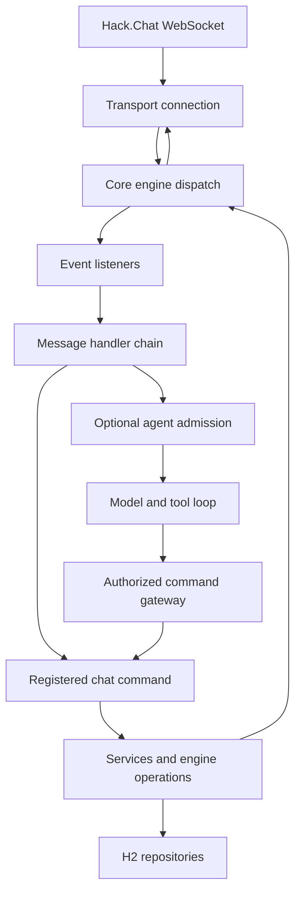

# Architecture

Zenbot is a Go application for Hack.Chat. The executable composes room connections, command handlers, services, H2 persistence, and an optional LLM agent. The agent uses the same authorized command execution boundary as chat commands; it does not own a second implementation of bot operations.

See [configuration](configuration.md) for setup, [commands](commands.md) for the user interface, and [agent internals](agent.md) for model execution.

## Process composition

[`cmd/zenbot/main.go`](../cmd/zenbot/main.go) is the production entrypoint. It loads configuration, optionally starts profiling, opens H2, and creates process-owned replica management, temporary room-session coordination, and the agent runtime. A host supervisor then constructs and starts the master room engine.

The master is replaceable. [`host_supervisor.go`](../cmd/zenbot/host_supervisor.go) coordinates replacement, while [`master_binding.go`](../cmd/zenbot/master_binding.go) supplies the current engine to process-owned callbacks. Agent command execution and reply delivery resolve this binding on use. Replacing a connection therefore does not require rebuilding the agent runtime or retaining a stale master pointer.

[`startup.go`](../cmd/zenbot/startup.go) connects transport failures and health checks to the host lifecycle controller. Shutdown closes the agent, stops the master and managed replicas, and closes the database and any owned H2 process. Timeouts bound the attempted cleanup; failures remain reportable errors.

## Request path

[`internal/transport/connection.go`](../internal/transport/connection.go) handles WebSocket dialing, frame reads, synchronized writes, pings, and connection close. Its bounded inbound channel preserves receipt timestamps for profiling. The transport deals in protocol frames; it does not interpret command permission or agent intent.

[`internal/core/engine_impl.go`](../internal/core/engine_impl.go) owns room state, listeners, command registration, outgoing messages, and operation entrypoints. Related core files handle host lifecycle, replica management, moderation, room snapshots, and support relays. The [`common.Engine`](../internal/common/engine.go) interface is the shared boundary used by listeners and commands.

[`internal/factory/engine_factory.go`](../internal/factory/engine_factory.go) constructs a usable engine graph. It installs transport, repositories, security and service dependencies, and the appropriate listeners. Production uses the error-returning `NewEngineWithOptions`; the compatibility `NewEngine` constructor has a fallback object and should not be treated as equivalent startup validation.

## Listeners and commands

Listeners translate protocol events into application work. Online-set and join/leave listeners maintain presence; chat and info listeners parse messages and route them through their supported paths. [`UserChatListener`](../internal/listener/user_chat_listener.go) normalizes whisper flags and carries a context into the [`message.Chain`](../internal/listener/message/chain.go). A handler can continue the chain, claim the event, or stop on error.

Command identity, aliases, permission metadata, and agent argument contracts live in [`internal/command/catalog`](../internal/command/catalog/catalog.go). Registered command handlers remain responsible for their actual behavior. [`internal/service/services.go`](../internal/service/services.go) groups security, users, mail, notes, activity, games, and external utility services. Services use narrower repository interfaces where available; some existing services also receive `*sql.DB`. The architecture is therefore not a strict repository-only persistence abstraction.

Agent calls pass through [`agent_gateway.go`](../internal/command/agent_gateway.go), which reconstructs a command with the trusted caller identity and current prefix, checks authority, captures output, and returns typed action/delivery receipts. Details of this boundary, including partial execution, are in [agent internals](agent.md).

## Room engines and temporary sessions

Master and replica engines represent maintained room connections. [`ReplicaManager`](../internal/core/replica_manager.go) and the production replica composition coordinate their ownership and lifecycle. The engine type named `AGENT` is a relay child requiring a host relay; it is distinct from the optional LLM agent runtime.

Cross-room operations use [`internal/listener/snapshot`](../internal/listener/snapshot/coordinator.go) and coordinated temporary sessions. The temporary online-set listener profile receives roster data without installing the normal chat, join, leave, and info behavior. A temporary-session registry makes these connections explicit resources to close. Do not use a permanent room engine as an implicit substitute for a bounded snapshot operation.

Remote roster lookup returns typed `{room, users, count, returnedCount, truncated}` data from its source operation. The current-room `room_users` agent tool uses the live room directory; remote lookup uses the command-backed `saturn_list` route. These are different evidence sources with different lifetimes.

## Persistence boundary

[`internal/repository/h2/database.go`](../internal/repository/h2/database.go) connects to a real H2 database through its PostgreSQL wire protocol using `pgx`/`database/sql`. This is H2, not a PostgreSQL server. The default process path requires Java and the pinned H2 JAR, can start an owned H2 server, and verifies database identity during open. The schema and upgrades are maintained alongside the adapter; see [`schema-h2.sql`](../internal/repository/h2/schema-h2.sql).

Repositories store identities and roles, presence and messages, command data, and agent memory. Agent conversation, outcome, and eligible read evidence use a single turn transaction. Summaries have their own source coverage metadata. Public-message queries filter message visibility; the H2 SQL schema named `PUBLIC` is a database namespace and is not a privacy label.

SQLite-related migration code is an import boundary for older data, not the production runtime backend. Database files are operational state and belong outside the published source tree.

## Trust and failure boundaries

Room metadata and configured/persisted roles determine authority. Chat text, model output, tool observations, stored history, and summaries cannot grant it. Agent tools expose capability-filtered contracts, while their implementations and command gateway still enforce the execution boundary.

An accepted local action or outgoing delivery is represented by a receipt. Such receipts support duplicate protection and honest failure reporting; they do not establish that a human read a message or that a compound natural-language request was satisfied. Cancellation is cooperative, especially across action and transport implementations.

Agent structured logging is designed around request IDs, counts, timings, and error codes. This is not a process-wide promise of content-free logs: [`CoreListener.Notify`](../internal/listener/core_listener.go) logs incoming payloads. Treat logs, H2 files, and provider access as part of deployment data handling. See [operations](operations.md).

## Where to change behavior

| Concern | Source boundary |
| --- | --- |
| Startup and dependency composition | `cmd/zenbot`, `internal/factory` |
| Protocol I/O and connection lifecycle | `internal/transport`, `internal/core` |
| Incoming event handling | `internal/listener`, `internal/listener/message` |
| Commands and their agent contracts | `internal/command`, `internal/command/catalog` |
| Domain operations and external utilities | `internal/service` |
| Storage and schema upgrades | `internal/repository`, `internal/repository/h2` |
| Model invocation, tools, memory, budgets | `internal/agent` |
| Prompt text and tool copy | `resources/agent` |

Follow [development](development.md) for build and verification commands. Source-level tests cover these boundaries separately: factory isolation, listener dispatch, command catalog parity, lifecycle ownership, H2 transactions, and agent protocol/receipt behavior. Passing those tests does not certify the semantic reliability of a configured model.
